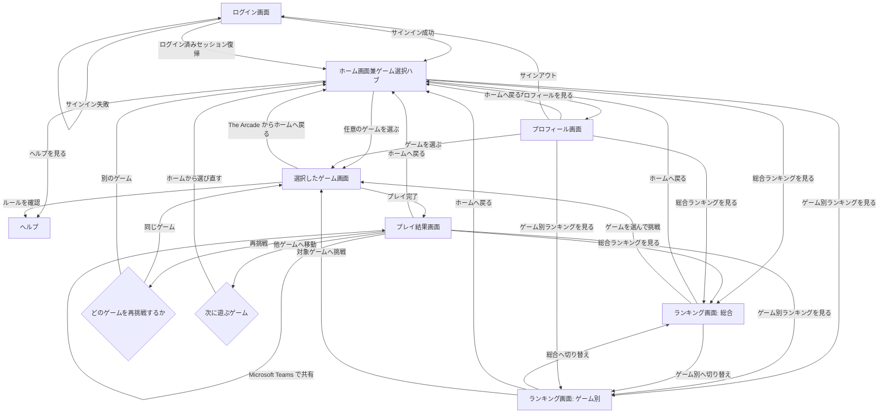
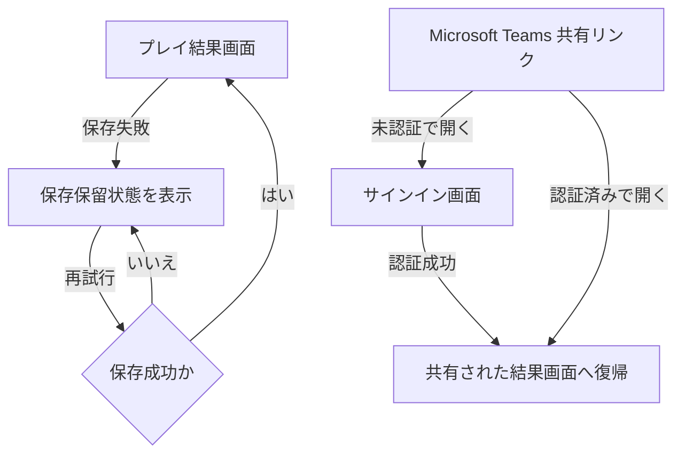

# Arcade App 画面遷移図

このドキュメントは、[product-requirements.md](./product-requirements.md) を補完する画面遷移図である。
ユーザ視点の主要導線、初回利用時の最短導線、ゲーム横断導線を整理する。

## Links

- Requirements: [product-requirements.md](./product-requirements.md)

## 1. 主要画面

- ログイン画面
- ヘルプ
- ホーム画面兼ゲーム選択ハブ
- ゲーム画面
- プレイ結果画面
- ランキング画面
- プロフィール画面

## 2. 画面遷移図

## 2.1 補助フロー

主要導線に加えて、MVP で必須となる例外系の振る舞いを次の補助フローで定義する。

## 3. 遷移の補足

### 3.0 画面表示の共通原則

- ホーム、ゲーム、結果、ランキング、プロフィールの主要操作は初期表示範囲で把握できるようにし、極力スクロールなしで次の行動へ進める
- 詳細説明、補助指標、例外情報は同時表示を避け、折りたたみ、タブ、差し替え表示で必要時だけ見せる
- 各画面のヘッダーは desktop では 1 行に収め、narrow viewport では hamburger などで折りたためるようにする
- 各画面のヘッダーでは過剰な border、nested pill、heavy shadow を避け、短いラベルまたは monochrome icon で機能分類を示す
- 案内文は最小限に留め、画面遷移、ボタン配置、強調された主要アクションで遊び方が伝わる構成を前提にする
- 画面外周の余白とセクション間の縦マージンは必要最小限に抑え、初期表示で確認できる情報量を優先する
- 境界線は既定の区切り手段にせず、まず余白、整列、背景トーン差で情報階層を表現する
- とくにホーム画面では左右や上下の余白で表示領域を浪費せず、ゲーム一覧と探索導線をできるだけ上部に詰めて配置する
- ホーム画面は情報ダッシュボードではなくゲーム選択ハブとし、100 個から 200 個規模のゲーム追加に耐える探索導線を優先する
- ホーム画面ではヘルプ本文を常設せず、必要時に開く補助レイヤとして扱う
- ホーム本文は game list、検索、絞り込み、並び替えだけで構成し、summary や recent result を置かない
- ホーム上部の第一視野では、game list と探索導線が最初に見えることを優先する
- ホームの各 game card は実ゲーム画面のスクリーンショット preview を主役にし、視覚的にゲーム内容を選べるようにする
- ホームの各 game card では、ゲーム名と短い状態ラベル以外の説明文を極力減らし、画像主導で比較できることを優先する
- ヘルプは各画面で共通利用できる補助レイヤとして扱い、呼び出し体験を画面ごとに分断しない
- ゲーム画面の常設 UI は、盤面、進行状態、難易度、必要時の run 終了 action までに絞り、自己ベストやランキング影響などの補助情報は結果画面または Help 側へ逃がす
- ゲーム画面の primary actions には `How to play` などの操作ガイド導線を含め、同じ補助レイヤ Component で game-specific な操作内容を 1 操作で開けること
- clear、failed、または explicit な終了 action の直後は、game screen 上で別の保存確定 step を挟まずそのまま Result screen へ遷移する
- touch device で必要な secondary action は toolbar などから明示的に切り替えられ、desktop 固有の context menu 操作へ依存しない
- run 前後で無効な control は disabled または同等の affordance で表現し、押しても反応しない見かけの button を残さない

### 3.1 初回利用

- ログイン後は全ユーザがまず `ホーム画面兼ゲーム選択ハブ` に着地する
- 初回利用者でも、ホーム画面本文に専用 onboarding overlay を自動表示しない
- 初回利用者は、一覧または検索、絞り込みからそのままゲームを開始できる
- 通常利用時のヘルプ確認は、ホーム上の明示的なヘルプ操作からのみ開ける

### 3.2 日常利用

- 通常は `ログイン画面` から `ホーム画面兼ゲーム選択ハブ` へ入る
- セッションが残っている場合は、ログイン画面を経由せず自然復帰してよい
- ユーザはホームで検索、絞り込み、並び替えを使って目的のゲームへ分岐する
- ユーザ設定として保存された `Light` または `Dark` テーマは、再訪時と再ログイン時に自動適用される

### 3.3 ゲーム横断

- 各ゲーム画面から `The Arcade` を通ってホームへ戻り、そこから別ゲームを選び直せる
- プレイ結果画面からもホーム経由で別ゲームへ移動できる
- ゲーム間を移動しても UI とテーマは共通で、学習コストを増やさない
- ホームへ戻ったときは、直前の検索条件、絞り込み、スクロール位置を可能な限り維持し、大量ゲーム一覧の再探索負荷を下げる
- ホーム、ゲーム、結果、ランキング、プロフィールのどこからでも、同じ共通ヘルプ UI を開けること

### 3.4 結果確認

- プレイ完了後の標準遷移先は `プレイ結果画面` とする
- `プレイ結果画面` からは再挑戦、他ゲーム移動、ホーム復帰、ランキング確認、`Microsoft Teams` 共有ができる
- 結果モーダルを使う場合も、最終的に参照可能な結果画面を持つ
- 順位や総合得点が即時計算できない場合は、結果画面で `集計待ち` または暫定値であることを明示する
- 保存失敗時は `保存保留` と再試行導線を表示し、確定前の値であることを明示する

### 3.5 ランキング

- `ランキング画面` は `総合` と `ゲーム別` を切り替えられる
- MVP の期間切り替えは `シーズン` と `累計` に限定する
- ランキングから、成績を伸ばしたい対象ゲームへ直接入れる

### 3.6 プロフィール

- `プロフィール画面` からランキングやゲームへ移動できる
- `プロフィール画面` ではアプリ内表示名、公開範囲、表示テーマを確認、変更できる
- サインアウト導線はプロフィール画面から辿りやすくする

### 3.7 例外系の遷移

- ゲーム画面から route を離れても、進行中 run を自動で結果保存しない
- `Microsoft Teams` 共有リンクを未認証で開いた場合は、サインイン後に該当の結果画面へ戻す
- セッション切れや保存失敗で結果確定ができない場合も、ユーザが再試行か再ログインを選べるようにする

## 4. MVP での画面遷移上の前提

- phase 1 lineup は `マインスイーパ`、`数独`、`Drop Ball`、`Color Sweep`、`Number Chain`、`Pair Flip` の 6 つ
- 初回利用時もホーム本文に追加フローを差し込まず、一覧と探索導線だけで開始できるようにする
- 通常時のヘルプ本文はホームに常時表示しない
- ヘルプは全画面で共通コンポーネントとして再利用できる前提で設計する
- テーマは `Light` と `Dark` の 2 系統を提供し、ユーザごとの選択を保持する
- `Microsoft Teams` 共有はプレイ結果画面からのみ提供する
- ランキング画面は `総合` と `ゲーム別` を 1 画面内タブ切り替えにしてもよい
- ランキング期間は `シーズン` と `累計` を提供する
- 共有リンク先は同一テナントの認証済みユーザのみ閲覧可能とする
- MVP では対象ゲーム数が少なくても、ホームの情報設計は将来的な 100 個から 200 個規模のゲーム追加を前提に固定し、後から全面再設計を必要としないこと
- 画面遷移図では `選択したゲーム画面` を 1 node に集約し、catalog 増設時に flow 図の全面書き換えが不要な構成を優先する
