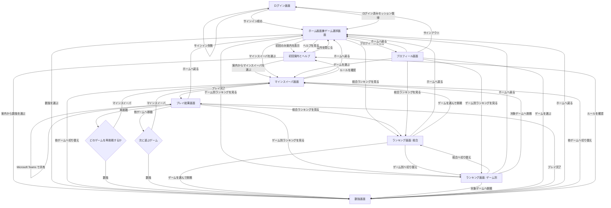
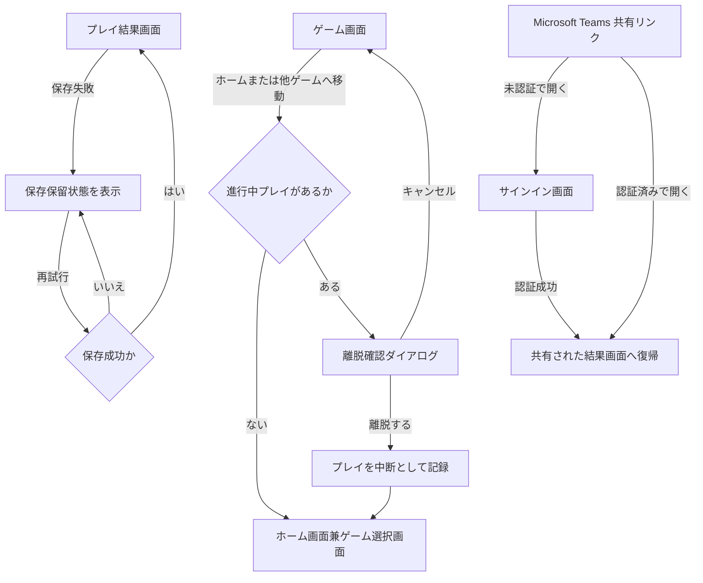

# Arcade App 画面遷移図

このドキュメントは、[product-requirements.md](./product-requirements.md) を補完する画面遷移図である。
ユーザ視点の主要導線、初回利用導線、ゲーム横断導線を整理する。

## Links

- Requirements: [product-requirements.md](./product-requirements.md)
- Execution plan: [../plan.md](../plan.md)

## 1. 主要画面

- ログイン画面
- 初回案内とヘルプ
- ホーム画面兼ゲーム選択画面
- ゲーム画面
- プレイ結果画面
- ランキング画面
- プロフィール画面

## 2. 画面遷移図

## 2.1 補助フロー

主要導線に加えて、MVP で必須となる例外系の振る舞いを次の補助フローで定義する。

## 3. 遷移の補足

### 3.0 画面表示の共通原則

- ホーム、ゲーム、結果、ランキング、プロフィールの主要操作は初期表示範囲で把握できるようにし、極力スクロールなしで次の行動へ進める
- 詳細説明、補助指標、例外情報は同時表示を避け、折りたたみ、タブ、差し替え表示で必要時だけ見せる
- 各画面のヘッダーには適切な絵文字と短いラベルを付け、ユーザが文字を読まなくても機能の種類を認識しやすくする
- 案内文は最小限に留め、画面遷移、ボタン配置、強調された主要アクションで遊び方が伝わる構成を前提にする

### 3.1 初回利用

- ログイン後は全ユーザがまず `ホーム画面兼ゲーム選択画面` に着地する
- 初回利用者には、ホーム画面上で一度だけ `初回案内とヘルプ` を自動表示する
- 初回案内はスキップ可能でもよいが、後から再表示できる
- 初回案内を終えたら `ホーム画面兼ゲーム選択画面` に戻るか、そのままゲームを開始できる

### 3.2 日常利用

- 通常は `ログイン画面` から `ホーム画面兼ゲーム選択画面` へ入る
- セッションが残っている場合は、ログイン画面を経由せず自然復帰してよい
- ユーザはホームからゲーム、ランキング、プロフィールへ分岐する

### 3.3 ゲーム横断

- 各ゲーム画面から別ゲームへ直接移動できる
- プレイ結果画面からも別ゲームへ直接移動できる
- ゲーム間を移動しても UI とテーマは共通で、学習コストを増やさない
- 進行中プレイからホームや他ゲームへ移動する場合は確認を挟み、離脱したプレイは `中断` として扱う

### 3.4 結果確認

- プレイ完了後の標準遷移先は `プレイ結果画面` とする
- `プレイ結果画面` からは再挑戦、他ゲーム移動、ホーム復帰、ランキング確認、`Microsoft Teams` 共有ができる
- 結果モーダルを使う場合も、最終的に参照可能な結果画面を持つ
- 順位や総合得点が即時計算できない場合は、結果画面で `集計待ち` または暫定値であることを明示する
- 保存失敗時は `保存保留` と再試行導線を表示し、確定前の値であることを明示する

### 3.5 ランキング

- `ランキング画面` は `総合` と `ゲーム別` を切り替えられる
- MVP の期間切り替えは `シーズン` と `累計` に限定する
- ランキングから、成績を伸ばしたい対象ゲームへ直接入れる

### 3.6 プロフィール

- `プロフィール画面` からランキングやゲームへ移動できる
- `プロフィール画面` ではアプリ内表示名と公開範囲を確認、変更できる
- サインアウト導線はプロフィール画面から辿りやすくする

### 3.7 例外系の遷移

- 進行中プレイからホームや他ゲームへ移動する場合は、確認ダイアログを表示する
- 確認後に離脱したプレイは `中断` として扱い、ランキングと総合得点には反映しない
- `Microsoft Teams` 共有リンクを未認証で開いた場合は、サインイン後に該当の結果画面へ戻す
- セッション切れや保存失敗で結果確定ができない場合も、ユーザが再試行か再ログインを選べるようにする

## 4. MVP での画面遷移上の前提

- 対象ゲームは `マインスイーパ` と `数独` の 2 つ
- 初回案内はホーム画面上の簡潔な 1 フローに留める
- `Microsoft Teams` 共有はプレイ結果画面からのみ提供する
- ランキング画面は `総合` と `ゲーム別` を 1 画面内タブ切り替えにしてもよい
- ランキング期間は `シーズン` と `累計` を提供する
- 共有リンク先は同一テナントの認証済みユーザのみ閲覧可能とする